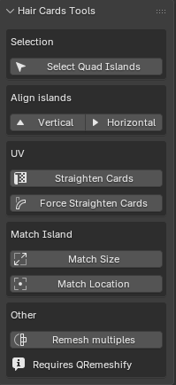
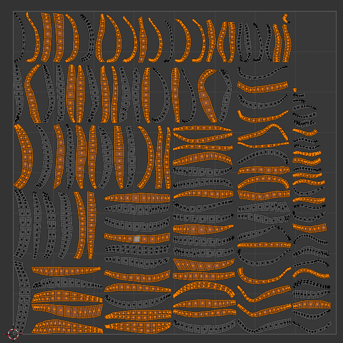
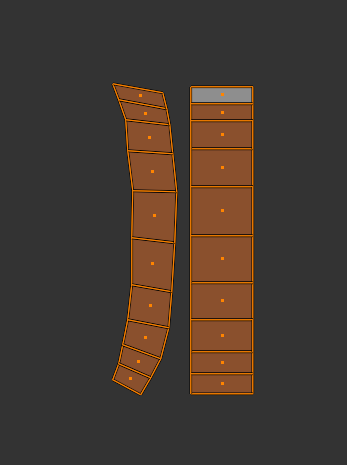
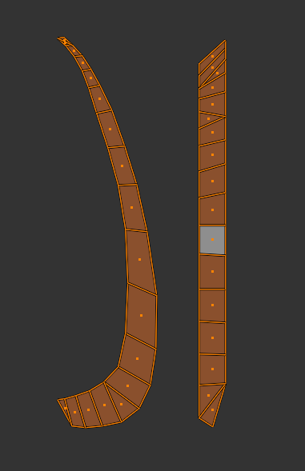

# Hair Cards Tools for Blender

Hair Cards Tools is a Blender add-on designed to simplify repetitive hair-card cleanup and UV editing tasks.

It provides a small set of specialized tools for selecting, aligning, straightening, matching, and remeshing hair cards directly inside Blender.

The goal is to reduce the amount of repetitive manual work required when cleaning or reorganizing large numbers of hair cards.

---

## Features

### Selection

#### Select Quad Islands
Automatically identifies UV islands made entirely of quad faces.

This is useful for quickly separating clean hair cards from cards that may require additional topology cleanup.

---

### Align Islands

#### Vertical
Rotates the selected UV islands so their main direction is aligned vertically.

Each island is processed independently.

#### Horizontal
Rotates the selected UV islands so their main direction is aligned horizontally.

Useful when preparing multiple cards for consistent UV organization.

---

### UV Straightening

#### Straighten Cards
Straightens compatible hair-card UV islands using a clean quad-based workflow.

Recommended for hair cards with regular quad topology.

This option provides the cleanest result when the topology is suitable.

#### Force Straighten Cards
Attempts to straighten more complex or imperfect hair-card UV islands.

Unlike the standard straightening tool, this mode is designed to work even when the card contains triangles or irregular topology.

The tool:

- Aligns each selected island vertically.
- Detects the outer sides of the card.
- Straightens UV vertex columns progressively.
- Preserves the vertical position of vertices while straightening columns.
- Stops propagation when ambiguous topology is detected.
- Supports terminal triangle tips when possible.
- Processes multiple selected UV islands independently.

This mode is intentionally more permissive.

It is useful when you do not want to manually clean every hair card before straightening it. The result may not always be perfect on complex topology, but regular portions of the card can still be straightened automatically.

---

### Match Island

#### Match Size
Resizes selected UV islands to match the size of the reference island.

Useful for maintaining consistent scale between similar hair cards.

#### Match Location
Moves selected UV islands to the location of the reference island.

Useful for stacking or organizing multiple similar hair-card UVs.

---

### Remeshing

#### Remesh Multiples
Remeshes multiple selected hair-card objects individually instead of treating the entire selection as one mesh.

This is useful when working with many separate hair cards that need quad remeshing.

> **Requires QRemeshify**

QRemeshify must be installed separately for this feature to work.

The rest of Hair Cards Tools does not require QRemeshify.

---

## Typical Workflow

A possible workflow is:

1. Prepare or separate your hair cards into individual objects if necessary.
2. Use **Remesh Multiples** to remesh multiple cards independently.
3. Clean problematic topology where necessary.
4. Use **Select Quad Islands** to quickly identify clean UV islands.
5. Use **Vertical** or **Horizontal** to organize their orientation.
6. Use **Straighten Cards** for clean quad-based cards.
7. Use **Force Straighten Cards** for cards with imperfect topology that you do not want to fully clean manually.
8. Use **Match Size** and **Match Location** to organize the final UV layout.

The tools are designed to complement each other rather than enforce a single workflow.

  

---

## Installation

1. Download the add-on.
2. Open Blender.
3. Go to:

   `Edit > Preferences > Add-ons`

   or the Extensions/Add-ons section used by your Blender version.

4. Install the add-on.
5. Enable **Hair Cards Tools**.

The tools will then be available from the relevant Blender sidebar/panel.

---

## Optional Dependency

### QRemeshify 
 
The **Remesh Multiples** feature requires the QRemeshify Blender extension. 
 
If QRemeshify is not installed, the other tools in this add-on can still be used normally.

For batch remeshing, it is recommended to process around **10 or less hair cards at a time**. Depending on your computer's performance and available resources, you may be able to process more cards simultaneously.

---

## Notes

Hair Cards Tools is primarily designed for hair-card workflows.

The **Straighten Cards** tool works best with clean quad topology.

The **Force Straighten Cards** tool is intended as a fallback for imperfect topology. It attempts to straighten the portions of the UV island that can be safely detected rather than forcing a potentially destructive result.

Complex topology may still require manual cleanup.

---

## Compatibility

Developed for modern versions of Blender.

Compatibility may vary between Blender versions, especially for features relying on third-party extensions such as QRemeshify.

---

## License

This project is licensed under the GNU General Public License v3.0 or later (GPL-3.0-or-later).

---

## Credits

Created as a workflow tool for simplifying hair-card creation, cleanup, remeshing, and UV organization in Blender.